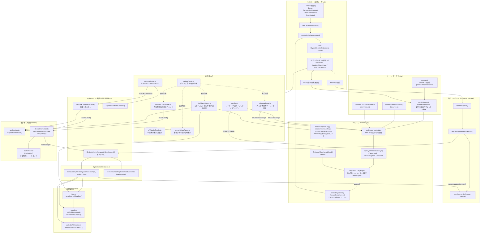

# viewer アプリ ファイル・関数フローチャート

`viewer/src`配下の現状(2026-07-30時点)のファイル構成と、主要な関数呼び出し・データの流れをまとめたもの。`types.ts`(共有型定義のみ)と`ui/icons.ts`(SVG文字列定数のみ)はロジックを持たないため図からは省略。

## 主要な流れの要約

1. **起動**: `main.ts`がThree.jsの土台(Scene/Camera/Renderer/OrbitControls)を作り、`SkyLayerMaterial`を積んだスフィアをシーンに追加。`SkyLockController`とUI一式を組み立てたあと`animate()`ループを開始し、並行して`main()`が全サーベイPNGのプリロードを始める。
2. **サーベイ表示**: `loadAllSurveys()`で読み込んだデータを`applyLayer()`が`SkyLayerMaterial.setLayer()`経由でシェーダーのuniformに反映。`layerBar.ts`のレイヤーA/B選択・ブレンドスライダーがこの`applyLayer`/`setBlend`を直接叩く。
3. **実際の空と同期モード**: `skyLockButton`押下で`SkyLockController.enable()`が位置情報とセンサー権限を取得し、`DeviceOrientationTracker`を起動。毎フレーム`update()`が最新のセンサー値を`skyCameraOrientation.computeSkyDirectionQuaternion()`に渡し、`astro/`配下の時刻→赤道座標→銀河座標→ワールド方向の変換チェーンを経てカメラの向きを決定、スムージングしてから`camera.quaternion`に反映する。
4. **デバッグツール群**: `headingCheckPanel`(センサー単体チェック)と`ringCheckButton`(コンパスリング単体表示)は、どちらも`skyLock.ts`を経由せず`sensors/`・`astro/`・`scene/createCompassRing.ts`を直接呼ぶ独立した検証ツール。`debugToggle`でまとめて表示/非表示を切り替えられる。
